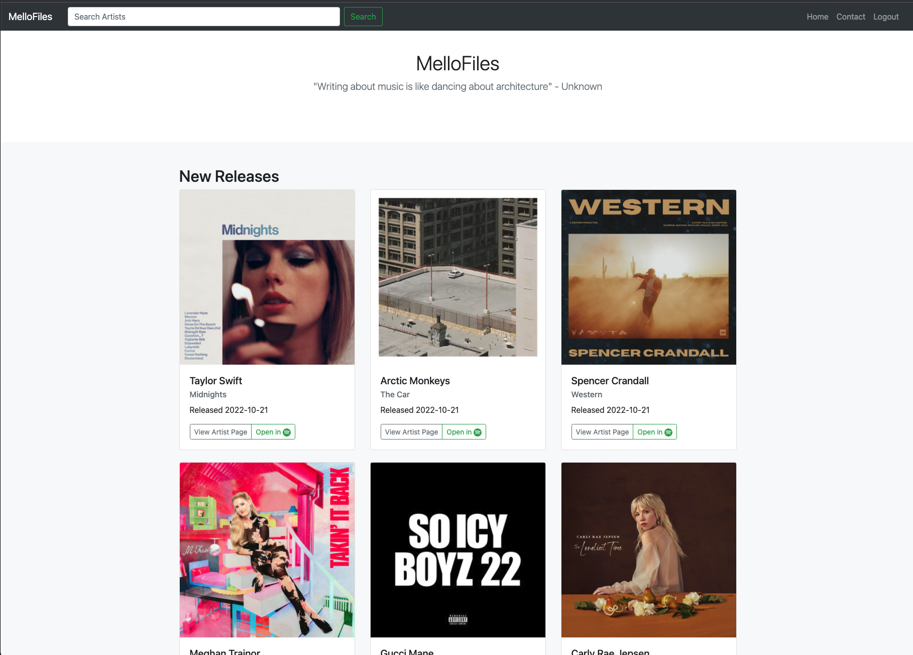
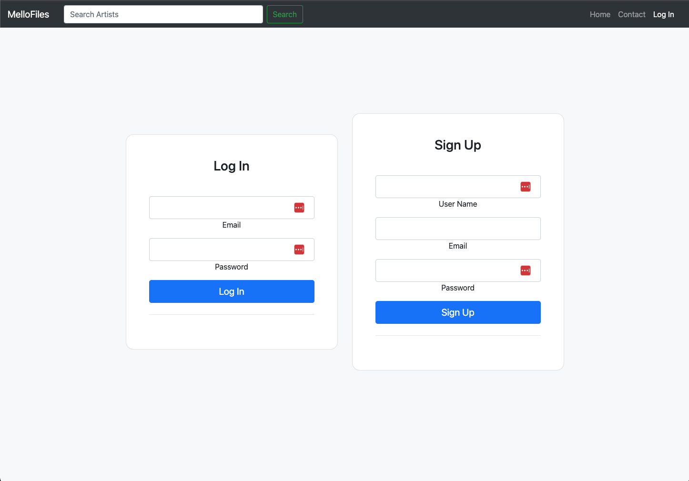
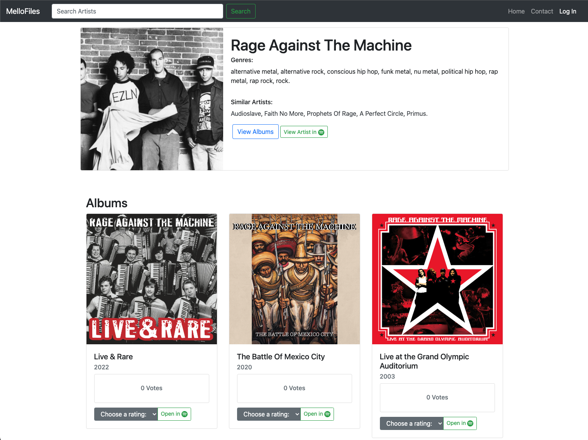
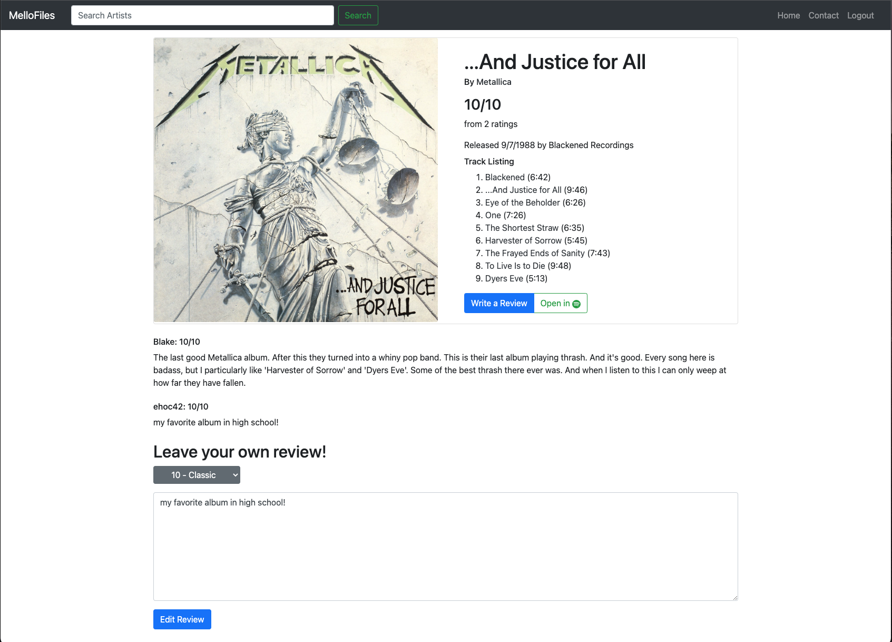

# MelloFiles
* [Description](#description)
* [Usage](#usage)
* [Link](#link)
* [Technologies](#technologies)
* [Medium Article](#medium-article)
* [Screenshots](#screenshots)

## Description
```
MelloFiles

This is a music rating app where a user can search an artists name, and see rating and review data 
for their albums. This site was created for music lovers who want to discover new music and share
their taste with others. The album and artist data are obtained using the Spotify Web Api. 
The deployed app can be viewed at mellofiles.herokuapp.com.

This project stemmed from a group project where I implemented the backend, and my teammates
implemented the backend. However, this is my version of the project called MelloFiles where I 
re-wrote the front-end and implemented some new features.

The home page renders news releases from spotify's api to inform the user about new released music.
There is a search bar in the navbar for users to search for an artist on each page. This will bring
the user to the associated artist page.

Each artist has an artist page. The artist page has metadata about the artists, as well as cards 
of each of their albums which include the average user rating and number of votes for each album.

Each album has an album page which the user can get to by clicking on the album art of said album
on the associated artist page. The album page shows metadata about the album as well as all the
user reviews for that album. This page is where a user would leave a review of their own for an
album.
 
```

## Usage
```
Users have the option of logging in, or surfing the site without signing up or logging in. If 
they are logged in, they can leave a rating or review. If Users are not logged in, they can still
look at ratings and reviews that other users have left. 

The home page renders news releases from spotify's api to inform the user about new released
music. If the user wants to see or leave ratings and reviews, they have to search for an artist
in the search bar which brings them to the artist page. For now, the search is a "I'm feeling 
lucky", as there isn't a such results page yet. The user will be directed to the artist page 
of the most popular search result for the search string given from Spotify.

The artist page has all of an artist's albums from spotify, and the average reviews for that
album in our database. Users are able to rate albums from this page. If the user is not logged
in and attempt to leave a rating, they will be redirected to the login page. Then after loggin
in or signing up, they will be redirected back to the page they were previously on.

A user can then click on one of the albums and go to the artist page where they can read other 
users' reviews for that album, and leave their own if they are logged in. The form to leave a 
review and the select button to choose a rating will only render if the user is logged in. 
If the user wants to leave a review, they must also leave a rating. 

There are many hyperlinks scatterred on the pages. On the artist page, the user can open the
artist's spotify page, as well as the spotify pages for each of their albums if they want to
listen to one of the albums. Every artist page also has links to the artist pages of related
artists so that the user can potentially discover new artists. 
```

## Link 
[Heroku Deployment of App](https://mellofiles.herokuapp.com/)

## Technologies
```
- Node.js
- JavaScript
- Handlebars.js
- Express.js
- MySql / Sequelize
- Bootstrap
- Spotify API
```

## Medium Article

I wrote a medium article about how this application handles the Client Credentials
authorization with the Spotify API. You can read it [here](https://medium.com/@hochwalderic/express-middleware-that-handles-client-credentials-authorization-to-the-spotify-api-84c9a88ccf2f).

## Sceenshots
Home Page:



Login Page:



Artist Page:



Album Page:




